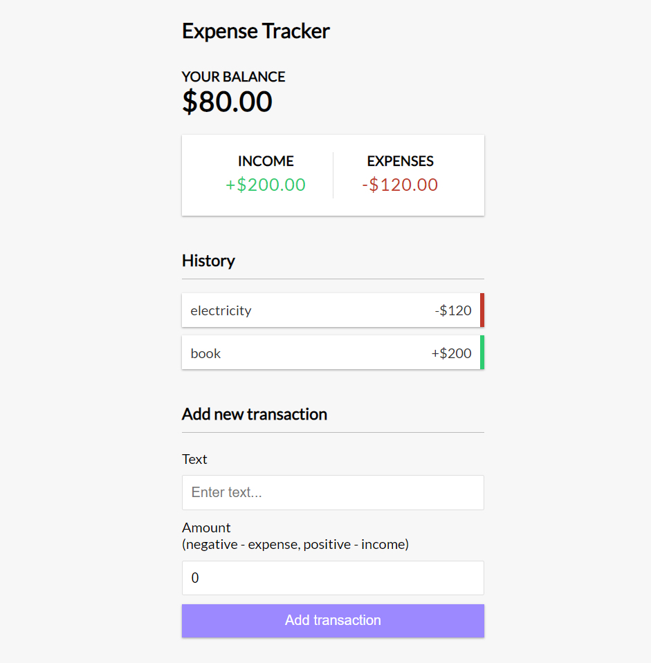

# simple-expense-tracker

A simple expense tracker for your daily expenses with React

### Instructions to run

1. clone repo to your machine
2. run command : **npm i**
3. run command : **npm start**

### Screenshots

